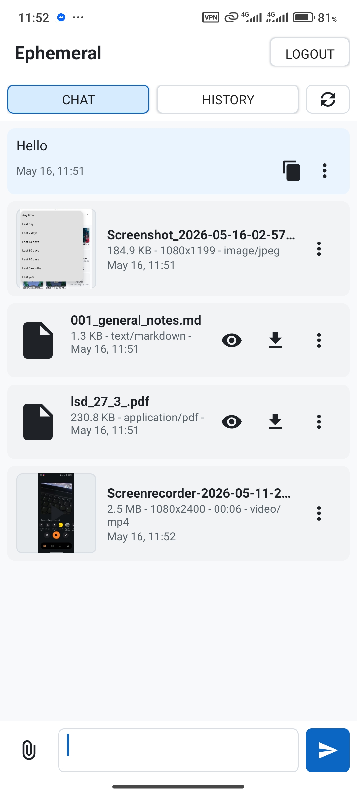
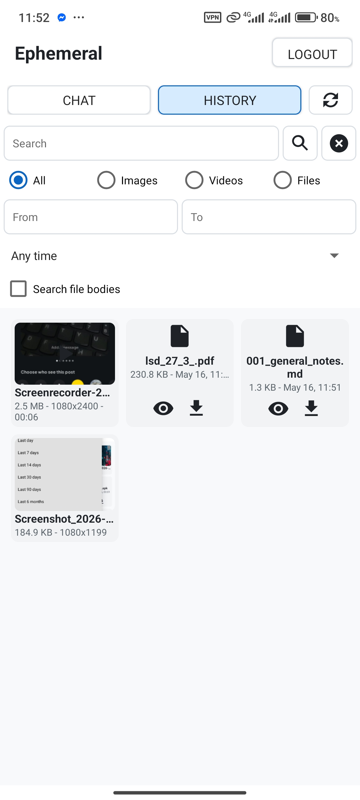

# Ephemeral Android

Native Android client for Ephemeral, a small single-user self-hosted app for sharing text messages and files across devices.

<table>
  <tr>
    <td width="50%" align="center">
      
      <br />
    </td>
    <td width="50%" align="center">
      
      <br />
    </td>
  </tr>
</table>

## Features

- Login or first-account setup with an Ephemeral backend.
- Chat feed with text messages, uploads, real-time updates.
- File upload queue with progress and cancellation.
- History screen with search, type filters, date filters, recent filters, text body search, refresh, and infinite scrolling.
- Image, GIF, and video media viewer.
- Text/code preview with syntax highlighting.

## Requirements

- JDK 17.
- Android SDK with API 36 installed.
- Android Gradle Plugin 8.13.1, resolved by Gradle.
- A running Ephemeral backend. Refer to [Ephemeral](https://github.com/adnope/ephemeral)

The app supports Android 8.0+ (`minSdk 26`) and targets Android API 36.

## Build

From the repository root:

```bash
./gradlew :app:assembleDebug
```

Build all APK variants:

```bash
./gradlew :app:assemble
```

Run unit tests:

```bash
./gradlew testDebugUnitTest
```

Build release APK and bundle:

```bash
./gradlew :app:assembleRelease :app:bundleRelease
```

Release signing uses `keystore.properties` at the repository root when present:

```properties
storeFile=/absolute/path/to/release.keystore
storePassword=...
keyAlias=...
keyPassword=...
```

## Install on a Connected Phone

With a phone connected through ADB:

```bash
./gradlew :app:installDebug && adb shell monkey -p com.ephemeral.android.debug 1
```

The debug package name is `com.ephemeral.android.debug`. The release package name is `com.ephemeral.android`.

## Project Layout

```text
app/src/main/java/com/ephemeral/android/
  MainActivity.java                  Top-level navigation and screen host
  data/api/                          Backend API interface and OkHttp implementation
  data/model/                        Item, metadata, paging, upload, and filter models
  data/session/                      Stored session state
  ui/chat/                           Chat screen
  ui/history/                        History grid and filters
  ui/media/                          Media viewer
  ui/preview/                        Text/code preview and highlighting
  ui/upload/                         Upload queue
  ui/common/                         Shared UI helpers such as image loading

app/src/main/res/
  layout/                            XML screens and rows
  drawable/                          Icons and backgrounds
  values/                            Strings, colors, dimensions, styles
```

## Network and Caching

- API calls use OkHttp and send/receive JSON where supported.
- Auth is cookie-based, session cookie is persisted locally.
- Real-time updates use SSE from `/api/events`, resume with `Last-Event-ID`, and reconcile both item collections after `stream:reset`.
- History thumbnails are kept in memory for the lifetime of the app process after loading.
- Full-size downloaded images are cached on disk with a 100 MB cache limit.
- Files downloaded through the Download action are written to the public Downloads collection.
